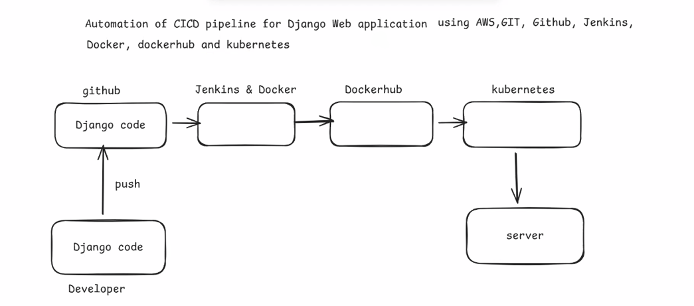
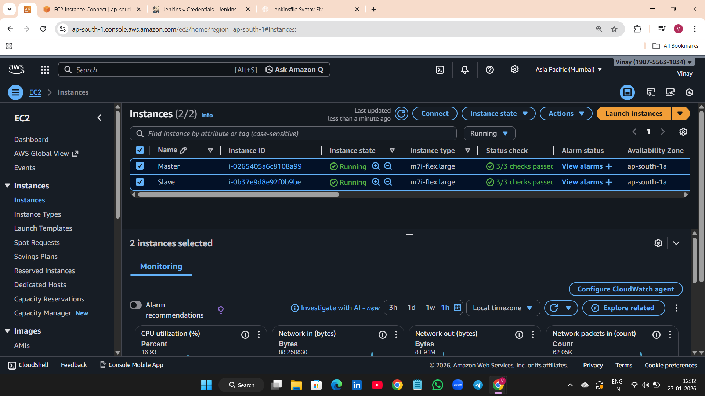
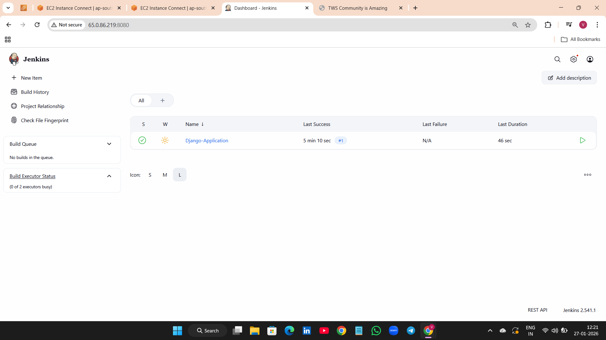
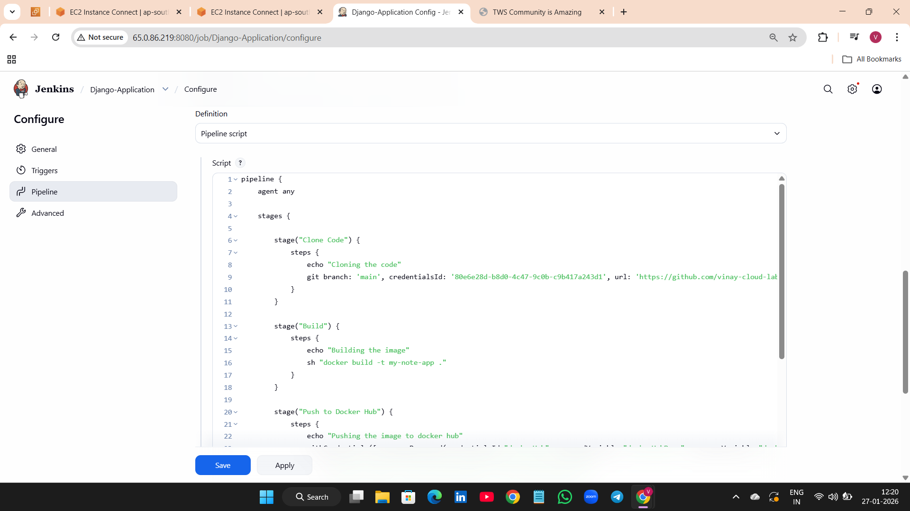
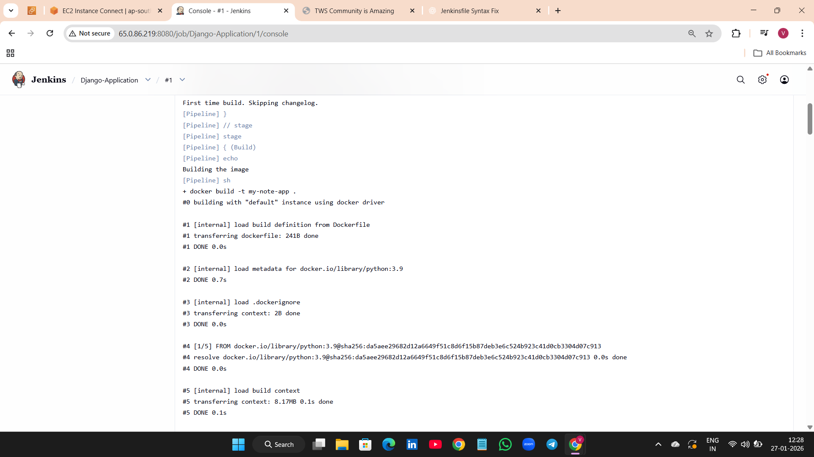
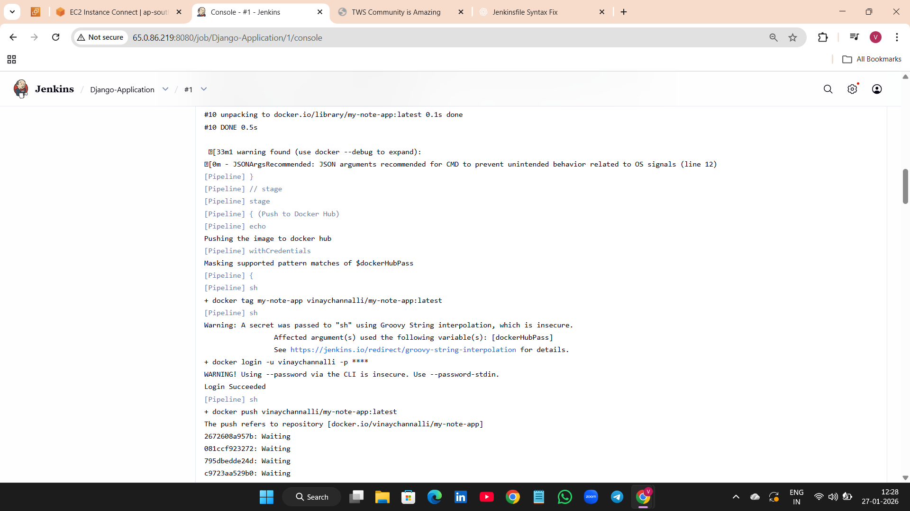
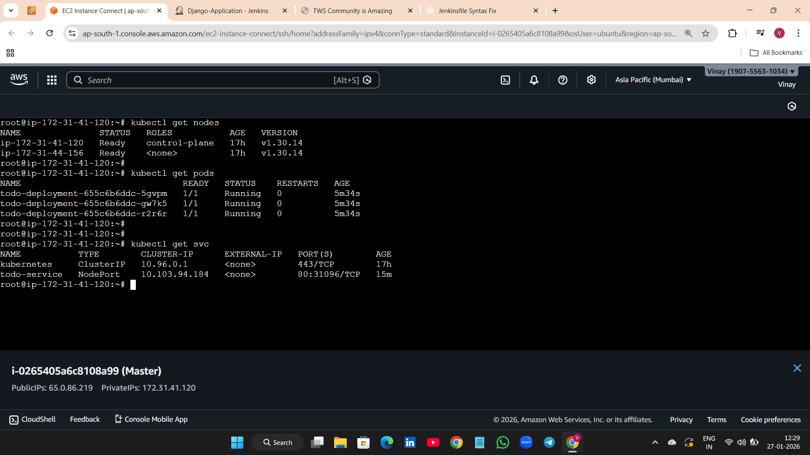
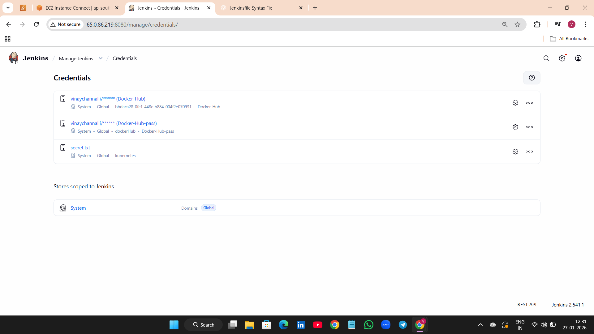
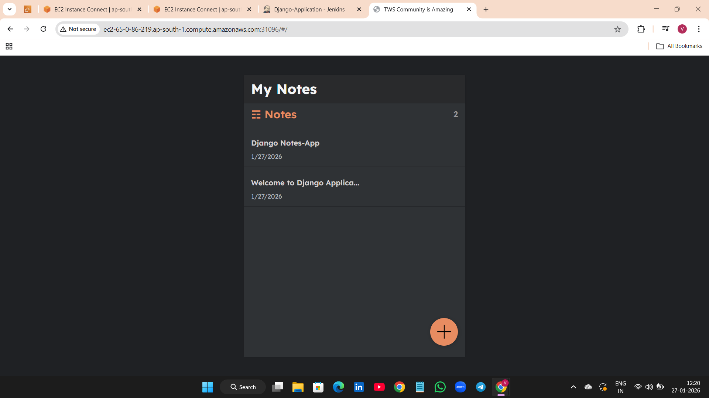

# Cloud-Native CI/CD Pipeline using Jenkins, Docker & Kubernetes

This project demonstrates a production-style DevOps CI/CD pipeline that automates building, containerizing, and deploying an application to a Kubernetes cluster using modern cloud-native tools.

---

## Project Overview

The pipeline automates the complete software delivery process:

Developer → GitHub → Jenkins → Docker → DockerHub → Kubernetes → Running Application

It showcases real-world DevOps practices including CI/CD automation, containerization, cloud infrastructure, and Kubernetes deployment.

---

## Tools & Technologies Used

| Tool | Purpose |
|------|---------|
| AWS EC2 | Cloud infrastructure (Jenkins + Kubernetes nodes) |
| Git & GitHub | Source code management |
| Jenkins | CI/CD pipeline automation |
| Docker | Containerization of application |
| Docker Hub | Container image registry |
| Kubernetes | Container orchestration and deployment |
| kubectl | Kubernetes CLI management |

---

## CI/CD Pipeline Stages

1. Clone Code – Jenkins pulls source code from GitHub  
2. Build Image – Docker image is built from Dockerfile  
3. Push Image – Image pushed to Docker Hub  
4. Deploy to Kubernetes – Application deployed using YAML manifests  

---

## Architecture Diagram

## AWS Infrastructure

## Jenkins CI/CD Pipeline

## Docker Build and Push

## Kubernetes Deployment

## Credentials Management

## Application Running

---
